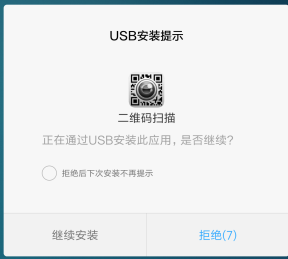
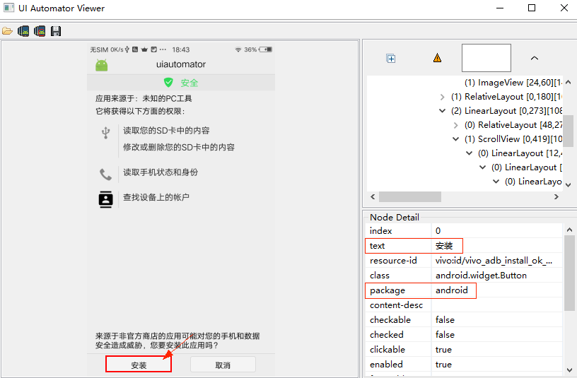

# uiautomator2 [](https://travis-ci.org/openatx/uiautomator2) [](https://pypi.python.org/pypi/uiautomator2)  [](https://ci.appveyor.com/project/openatx/uiautomator2)

各种库的版本号

- [](https://pypi.python.org/pypi/uiautomator2)
- [](https://github.com/openatx/atx-agent)
- 
- 
- 
- 

**该项目正在火热的开发中** QQ群号: *499563266*

**突然插入的招聘**：目前作者的组里（阿里巴巴淘宝质量部：坐标杭州西溪园区）正在进行招聘（HIRE）
具体内容这里可以看到 https://testerhome.com/topics/23010

<p align="left"></div>

[UiAutomator](https://developer.android.com/training/testing/ui-automator.html)是Google提供的用来做安卓自动化测试的一个Java库，基于Accessibility服务。功能很强，可以对第三方App进行测试，获取屏幕上任意一个APP的任意一个控件属性，并对其进行任意操作，但有两个缺点：1. 测试脚本只能使用Java语言 2. 测试脚本要打包成jar或者apk包上传到设备上才能运行。

我们希望测试逻辑能够用Python编写，能够在电脑上运行的时候就控制手机。这里要非常感谢 Xiaocong He ([@xiaocong][])，他将这个想法实现了出来（见[xiaocong/uiautomator](https://github.com/xiaocong/uiautomator)），原理是在手机上运行了一个http rpc服务，将uiautomator中的功能开放出来，然后再将这些http接口封装成Python库。
因为`xiaocong/uiautomator`这个库，已经很久不见更新。所以我们直接fork了一个版本，为了方便做区分我们就在后面加了个2 [openatx/uiautomator2](https://github.com/openatx/uiautomator2)

除了对原有的库的bug进行了修复，还增加了很多新的Feature。主要有以下部分：

* 设备和开发机可以脱离数据线，通过WiFi互联（基于[atx-agent](https://github.com/openatx/atx-agent)）
* 集成了[openstf/minicap](https://github.com/openstf/minicap)达到实时屏幕投频，以及实时截图
* 集成了[openstf/minitouch](https://github.com/openstf/minitouch)达到精确实时控制设备
* 修复了[xiaocong/uiautomator](https://github.com/xiaocong/uiautomator)经常性退出的问题
* 代码进行了重构和精简，方便维护
* 实现了一个设备管理平台(也支持iOS) [atxserver2](https://github.com/openatx/atxserver2)
* 扩充了toast获取和展示的功能

>这里要先说明下，因为经常有很多人问 openatx/uiautomator2 并不支持iOS测试，需要iOS自动化测试，可以转到这个库 [openatx/facebook-wda](https://github.com/openatx/facebook-wda)。

> PS: 这个库 ~~<https://github.com/NeteaseGame/ATX>~~ 目前已经不维护了，请尽快更换。

这里有一份快速参考，适合已经入门的人 [QUICK REFERENCE GUIDE](QUICK_REFERENCE.md)，欢迎多提意见。

## Requirements
- Android版本 4.4+
- Python 3.6+ (社区反馈3.8.0不支持, 但是3.8.2支持）

>如果用python2的pip安装，会安装本库的老版本0.2.3；如果用python3.5的pip安装，会安装本库的老版本0.3.3；两者均已经不会再维护；PYPI上的最近版本是这个：https://pypi.org/project/uiautomator2/

## QUICK START
先准备一台（不要两台）开启了`开发者选项`的安卓手机，连接上电脑，确保执行`adb devices`可以看到连接上的设备。

运行`pip3 install -U uiautomator2` 安装uiautomator2

运行`python3 -m uiautomator2 init`安装包含httprpc服务的apk到手机+`atx-agent, minicap, minitouch` （在过去的版本中，这一步是必须执行的，但是从1.3.0之后的版本，当运行python代码`u2.connect()`时就会自动推送这些文件了）

命令行运行`python`打开python交互窗口。然后将下面的命令输入到窗口中。

```python
import uiautomator2 as u2

d = u2.connect() # connect to device
print(d.info)
```

这时看到类似下面的输出，就可以正式开始用我们这个库了。因为这个库功能太多，后面还有很多的内容，需要慢慢去看 ....

```
{'currentPackageName': 'net.oneplus.launcher', 'displayHeight': 1920, 'displayRotation': 0, 'displaySizeDpX': 411, 'displaySizeDpY': 731, 'displayWidth': 1080, 'productName': 'OnePlus5', '
screenOn': True, 'sdkInt': 27, 'naturalOrientation': True}
```

一般情况下都会成功，不过也可能会有意外。可以加QQ群反馈问题，群里有很多大佬可以帮你解决问题。

## Sponsors
Thank you to all our sponsors! ✨🍰✨

### 金牌赞助商（Gold Sponsor）


[霍格沃兹测试学院](https://ceshiren.com/)是业界领先的测试开发技术高端教育品牌，隶属于测吧（北京）科技有限公司。学院课程均由 BAT 一线测试大咖执教，提供实战驱动的接口自动化测试、移动自动化测试、性能测试、持续集成与 DevOps 等技术培训，以及测试开发优秀人才内推服务。[点击学习!](http://qrcode.testing-studio.com/f?from=ATX&url=https://ke.qq.com/course/254956)

[霍格沃兹测试学院](https://ceshiren.com/)是 ATX 的首家金牌赞助商。

## 相关项目
- 设备管理平台，设备多了就会用到 [atxserver2](https://github.com/openatx/atxserver2)
- 专门与adb进行交互的库 [adbutils](https://github.com/openatx/adbutils)
- [atx-agent](https://github.com/openatx/atx-agent) 运行在设备上的驻守程序，go开发，用于保活设备上相关的服务
- [weditor](https://github.com/openatx/weditor) 类似于uiautomatorviewer，专门为本项目开发的辅助编辑器

**[Installation](#installation)**

**[Connect to a device](#connect-to-a-device)**

**[Command line](#command-line)**

**[Global settings](#global-settings)**
  - **[Debug HTTP requests](#debug-http-requests)**
  - **[Implicit wait](#implicit-wait)**

**[App management](#app-management)**
  - **[Install an app](#install-an-app)**
  - **[Launch an app](#launch-an-app)**
  - **[Stop an app](#stop-an-app)**
  - **[Stop all running apps](#stop-all-running-apps)**
  - **[Push and pull files](#push-and-pull-files)**
  - **[Auto click permission dialogs](#auto-click-permission-dialogs)**

**[UI automation](#basic-api-usages)**
  - **[Shell commands](#shell-commands)**
  - **[Session](#session)**
  - **[Retrieve the device info](#retrieve-the-device-info)**
  - **[Key Events](#key-events)**
  - **[Gesture interaction with the device](#gesture-interaction-with-the-device)**
  - **[Screen-related](#screen-related)**
  - **[Selector](#selector)**
  - **[Watcher](#watcher)**
  - **[Global settings](#global-settings)**
  - **[Input method](#input-method)**
  - **[Toast](#toast)**
  - **[XPath](#xpath)**
  - **[Screenrecord](#screenrecord)**
  - **[Image match](#image-match)**

**[相关文章推荐](#article-recommended)**

**常见问题**
  - **[停止UiAutomator守护服务，释放AccessibilityService](#stop-uiautomator)**
  - **[502错误](https://github.com/openatx/uiautomator2/wiki/Common-issues)**
  - **[Connection Error, 深度睡眠, 点击偏差 等](https://github.com/openatx/uiautomator2/wiki/Common-issues)**
  

**[实验性功能](https://github.com/openatx/uiautomator2/wiki/Common-issues#%E5%AE%9E%E9%AA%8C%E6%80%A7%E5%8A%9F%E8%83%BD)**
  - **远程投屏**
  - **htmlreport**
  - **诊断uiautomator2方法**
  - **Plugin**
  - **Hooks**
  - **失败时弹出提示框**

**[项目历史](#项目历史)**

**[Contributors](#contributors)**

**[LICENSE](#license)**


# Installation
1. Install uiautomator2

    ```bash
    # Since uiautomator2 is still under development, you have to add --pre to install the development version
    pip install --upgrade --pre uiautomator2

    # Or you can install directly from github source
    git clone https://github.com/openatx/uiautomator2
    pip install -e uiautomator2
    ```
    
    测试是否安装成功 `uiautomator2 --help`
    
2. Install weditor (UI Inspector)

    因为uiautomator是独占资源，所以当atx运行的时候uiautomatorviewer是不能用的，为了减少atx频繁的启停，我们开发了基于浏览器技术的weditor UI查看器。<https://github.com/openatx/weditor>

    安装方法(备注: 目前最新的稳定版为 0.1.0)

    ```bash
    pip install -U weditor
    ```
    
    安装好之后，就可以在命令行运行`weditor --help` 确认是否安装成功了。

    > Windows系统可以使用命令在桌面创建一个快捷方式 `weditor --shortcut`

    命令行直接输入 `weditor` 会自动打开浏览器，输入设备的ip或者序列号，点击Connect即可。

    具体参考文章：[浅谈自动化测试工具python-uiautomator2](https://testerhome.com/topics/11357)
    
3. Install daemons to a device (Optional)

    电脑连接上一个手机或多个手机, 确保adb已经添加到环境变量中，执行下面的命令会自动安装本库所需要的设备端程序：[uiautomator-server](https://github.com/openatx/android-uiautomator-server/releases) 、[atx-agent](https://github.com/openatx/atx-agent)、[openstf/minicap](https://github.com/openstf/minicap)、[openstf/minitouch](https://github.com/openstf/minitouch)

    ```bash
    # init 所有的已经连接到电脑的设备
    python -m uiautomator2 init
    ```

    有时候init也会出错，请参考[手动Init指南](https://github.com/openatx/uiautomator2/wiki/Manual-Init)

    安装提示`success`即可

4. 【可选】AppetizerIO 所见即所得脚本编辑器

    [AppetizerIO](https://www.appetizer.io) 提供了对uiautomator2的深度集成，可以图形化管理ATX设备，还有所见即所得脚本编辑器
    * 到网站下载直接打开，首次使用需要注册账号
    * `设备管理` 界面里可以检查设备是否正常init，起停atx-agent，抓取atx-agent.log文件
    * `测试脚本`调出脚本助手，实时界面同步，点击界面直接插入各种代码，同时支持uiautomator和Appium
    * **[视频教程 请戳这里](https://github.com/openatx/uiautomator2/wiki/Appetizer%E6%89%80%E8%A7%81%E5%8D%B3%E6%89%80%E5%BE%97u2%E8%84%9A%E6%9C%AC%E7%BC%96%E8%BE%91%E5%99%A8)**  [其他文档在此](http://doc.appetizer.io)
    
# Connect to a device
There are two ways to connect to the device. 

1. **Through WiFi**

Suppose device IP is `10.0.0.1` and your PC is in the same network.

```python
import uiautomator2 as u2

d = u2.connect('10.0.0.1') # alias for u2.connect_wifi('10.0.0.1')
print(d.info)
```

2. **Through USB**

Suppose the device serial is `123456f` (seen from `adb devices`)

```python
import uiautomator2 as u2

d = u2.connect('123456f') # alias for u2.connect_usb('123456f')
print(d.info)
```

3. **Through ADB WiFi**

```python
import uiautomator2 as u2

d = u2.connect_adb_wifi("10.0.0.1:5555")

# Equals to 
# + Shell: adb connect 10.0.0.1:5555
# + Python: u2.connect_usb("10.0.0.1:5555")
```

Calling `u2.connect()` with no argument, `uiautomator2` will obtain device IP from the environment variable `ANDROID_DEVICE_IP` or `ANDROID_SERIAL`.
If this environment variable is empty, uiautomator will fall back to `connect_usb` and you need to make sure that there is only one device connected to the computer.

# Command line
其中的`$device_ip`代表设备的ip地址

如需指定设备需要传入`--serial` 如 `python3 -m uiautomator2 --serial bff1234 <SubCommand>`, SubCommand为子命令（init,或者screenshot等）

> 1.0.3 Added: `python3 -m uiautomator2`可以简写为`uiautomator2`

- screenshot: 截图

    ```bash
    $ uiautomator2 screenshot screenshot.jpg
    ```

- current: 获取当前包名和activity

    ```bash
    $ uiautomator2 current
    {
        "package": "com.android.browser",
        "activity": "com.uc.browser.InnerUCMobile",
        "pid": 28478
    }
    ```
    
- uninstall： 卸载

    ```bash
    $ uiautomator2 uninstall <package-name> # 卸载一个包
    $ uiautomator2 uninstall <package-name-1> <package-name-2> # 卸载多个包
    $ uiautomator2 uninstall --all # 全部卸载
    ```

- stop: 停止应用

    ```bash
    $ uiautomator2 stop com.example.app # 停止一个app
    $ uiautomator2 stop --all # 停止所有的app
    ```
    
- install: 安装apk，apk通过URL给出 (暂时不能用)
- healthcheck: 健康检查 (暂不能用)

    
# API Documents

### New command timeout
How long (in seconds) will wait for a new command from the client before assuming the client quit and ending the uiautomator service （Default 3 minutes）

配置accessibility服务的最大空闲时间，超时将自动释放。默认3分钟。

```python
d.set_new_command_timeout(300) # change to 5 minutes, unit seconds
```

### Debug HTTP requests
Trace HTTP requests and response to find out how it works.

```python
>>> d.debug = True
>>> d.info
12:32:47.182 $ curl -X POST -d '{"jsonrpc": "2.0", "id": "b80d3a488580be1f3e9cb3e926175310", "method": "deviceInfo", "params": {}}' 'http://127.0.0.1:54179/jsonrpc/0'
12:32:47.225 Response >>>
{"jsonrpc":"2.0","id":"b80d3a488580be1f3e9cb3e926175310","result":{"currentPackageName":"com.android.mms","displayHeight":1920,"displayRotation":0,"displaySizeDpX":360,"displaySizeDpY":640,"displayWidth":1080,"productName"
:"odin","screenOn":true,"sdkInt":25,"naturalOrientation":true}}
<<< END
```

### Implicit wait
Set default element wait time, unit seconds

设置元素查找等待时间（默认20s）

```python
d.implicitly_wait(10.0) # 也可以通过d.settings['wait_timeout'] = 10.0 修改
d(text="Settings").click() # if Settings button not show in 10s, UiObjectNotFoundError will raised

print("wait timeout", d.implicitly_wait()) # get default implicit wait
```

This function will have influence on `click`, `long_click`, `drag_to`, `get_text`, `set_text`, `clear_text`, etc.

## App management
This part showcases how to perform app management

### Install an app
We only support installing an APK from a URL

```python
d.app_install('http://some-domain.com/some.apk')
```

### Launch an app
```python
# 默认的这种方法是先通过atx-agent解析apk包的mainActivity，然后调用am start -n $package/$activity启动
d.app_start("com.example.hello_world")

# 使用 monkey -p com.example.hello_world -c android.intent.category.LAUNCHER 1 启动
# 这种方法有个副作用，它自动会将手机的旋转锁定给关掉
d.app_start("com.example.hello_world", use_monkey=True) # start with package name

# 通过指定main activity的方式启动应用，等价于调用am start -n com.example.hello_world/.MainActivity
d.app_start("com.example.hello_world", ".MainActivity")
```

### Stop an app
```python
# equivalent to `am force-stop`, thus you could lose data
d.app_stop("com.example.hello_world") 
# equivalent to `pm clear`
d.app_clear('com.example.hello_world')
```

### Stop all running apps
```python
# stop all
d.app_stop_all()
# stop all app except for com.examples.demo
d.app_stop_all(excludes=['com.examples.demo'])
```

### Get app info
```python
d.app_info("com.examples.demo")
# expect output
#{
#    "mainActivity": "com.github.uiautomator.MainActivity",
#    "label": "ATX",
#    "versionName": "1.1.7",
#    "versionCode": 1001007,
#    "size":1760809
#}

# save app icon
img = d.app_icon("com.examples.demo")
img.save("icon.png")
```

### List all running apps
```python
d.app_list_running()
# expect output
# ["com.xxxx.xxxx", "com.github.uiautomator", "xxxx"]
```

### Wait until app running
```python
pid = d.app_wait("com.example.android") # 等待应用运行, return pid(int)
if not pid:
    print("com.example.android is not running")
else:
    print("com.example.android pid is %d" % pid)

d.app_wait("com.example.android", front=True) # 等待应用前台运行
d.app_wait("com.example.android", timeout=20.0) # 最长等待时间20s（默认）
```

> Added in version 1.2.0

### Push and pull files
* push a file to the device

    ```python
    # push to a folder
    d.push("foo.txt", "/sdcard/")
    # push and rename
    d.push("foo.txt", "/sdcard/bar.txt")
    # push fileobj
    with open("foo.txt", 'rb') as f:
        d.push(f, "/sdcard/")
    # push and change file access mode
    d.push("foo.sh", "/data/local/tmp/", mode=0o755)
    ```

* pull a file from the device

    ```python
    d.pull("/sdcard/tmp.txt", "tmp.txt")

    # FileNotFoundError will raise if the file is not found on the device
    d.pull("/sdcard/some-file-not-exists.txt", "tmp.txt")
    ```

### 检查并维持设备端守护进程处于运行状态
```python
d.healthcheck()
```

### ~~Auto click permission dialogs~~
**注意注意** `disable_popups`函数，检测发现很不稳定，暂时不要使用，等候通知。

Import in version 0.1.1

```python
d.disable_popups() # automatic skip popups
d.disable_popups(False) # disable automatic skip popups
```



If this method is not working on your device, You can make a pull request or create an issue to enhance this function. I'll show you how to do it.

1. Open `uiautomatorviewer.bat`
2. Get popup hierarchy



Now you know the button text and current package name. Make a pull request by update function `disable_popups` or create an [issue](https://github.com/openatx/uiautomator2/issues) if you are not familar with git and python.

## Basic API Usages
This part showcases how to perform common device operations:

### Shell commands
* Run a short-lived shell command with a timeout protection. (Default timeout 60s)

    Note: timeout support require `atx-agent >=0.3.3`

    `adb_shell` function is deprecated. Use `shell` instead.

    Simple usage

    ```python
    output, exit_code = d.shell("pwd", timeout=60) # timeout 60s (Default)
    # output: "/\n", exit_code: 0
    # Similar to command: adb shell pwd

    # Since `shell` function return type is `namedtuple("ShellResponse", ("output", "exit_code"))`
    # so we can do some tricks
    output = d.shell("pwd").output
    exit_code = d.shell("pwd").exit_code
    ```

    The first argument can be list. for example

    ```python
    output, exit_code = d.shell(["ls", "-l"])
    # output: "/....", exit_code: 0
    ```

   This returns a string for stdout merged with stderr.
   If the command is a blocking command, `shell` will also block until the command is completed or the timeout kicks in. No partial output will be received during the execution of the command. This API is not suitable for long-running commands. The shell command given runs in a similar environment of `adb shell`, which has a Linux permission level of `adb` or `shell` (higher than an app permission).

* Run a long-running shell command

    add stream=True will return `requests.models.Response` object. More info see [requests stream](http://docs.python-requests.org/zh_CN/latest/user/quickstart.html#id5)

    ```python
    r = d.shell("logcat", stream=True)
    # r: requests.models.Response
    deadline = time.time() + 10 # run maxium 10s
    try:
        for line in r.iter_lines(): # r.iter_lines(chunk_size=512, decode_unicode=None, delimiter=None)
            if time.time() > deadline:
                break
            print("Read:", line.decode('utf-8'))
    finally:
        r.close() # this method must be called
    ```

    Command will be terminated when `r.close()` called.
    
### Session
Session represent an app lifecycle. Can be used to start app, detect app crash.

* Launch and close app

    ```python
    sess = d.session("com.netease.cloudmusic") # start 网易云音乐
    sess.close() # 停止网易云音乐
    sess.restart() # 冷启动网易云音乐
    ```

* Use python `with` to launch and close app

    ```python
    with d.session("com.netease.cloudmusic") as sess:
        sess(text="Play").click()
    ```

* Attach to the running app

    ```python
    # launch app if not running, skip launch if already running
    sess = d.session("com.netease.cloudmusic", attach=True)

    # raise SessionBrokenError if not running
    sess = d.session("com.netease.cloudmusic", attach=True, strict=True)
    ```

* Detect app crash

    ```python
    # When app is still running
    sess(text="Music").click() # operation goes normal

    # If app crash or quit
    sess(text="Music").click() # raise SessionBrokenError
    # other function calls under session will raise SessionBrokenError too
    ```

    ```python
    # check if session is ok.
    # Warning: function name may change in the future
    sess.running() # True or False
    ```


### Retrieve the device info

Get basic information

```python
d.info
```

Below is a possible output:

```
{ 
    u'displayRotation': 0,
    u'displaySizeDpY': 640,
    u'displaySizeDpX': 360,
    u'currentPackageName': u'com.android.launcher',
    u'productName': u'takju',
    u'displayWidth': 720,
    u'sdkInt': 18,
    u'displayHeight': 1184,
    u'naturalOrientation': True
}
```

Get window size

```python
print(d.window_size())
# device upright output example: (1080, 1920)
# device horizontal output example: (1920, 1080)
```

Get current app info. For some android devices, the output could be empty (see *Output example 3*)

```python
print(d.app_current())
# Output example 1: {'activity': '.Client', 'package': 'com.netease.example', 'pid': 23710}
# Output example 2: {'activity': '.Client', 'package': 'com.netease.example'}
# Output example 3: {'activity': None, 'package': None}
```

Wait activity

```python
d.wait_activity(".ApiDemos", timeout=10) # default timeout 10.0 seconds
# Output: true of false
```

Get device serial number

```python
print(d.serial)
# output example: 74aAEDR428Z9
```

Get WLAN ip

```python
print(d.wlan_ip)
# output example: 10.0.0.1
```

Get detailed device info

```python
print(d.device_info)
```

Below is a possible output:

```
{'udid': '3578298f-b4:0b:44:e6:1f:90-OD103',
 'version': '7.1.1',
 'serial': '3578298f',
 'brand': 'SMARTISAN',
 'model': 'OD103',
 'hwaddr': 'b4:0b:44:e6:1f:90',
 'port': 7912,
 'sdk': 25,
 'agentVersion': 'dev',
 'display': {'width': 1080, 'height': 1920},
 'battery': {'acPowered': False,
  'usbPowered': False,
  'wirelessPowered': False,
  'status': 3,
  'health': 0,
  'present': True,
  'level': 99,
  'scale': 100,
  'voltage': 4316,
  'temperature': 272,
  'technology': 'Li-ion'},
 'memory': {'total': 3690280, 'around': '4 GB'},
 'cpu': {'cores': 8, 'hardware': 'Qualcomm Technologies, Inc MSM8953Pro'},
 'presenceChangedAt': '0001-01-01T00:00:00Z',
 'usingBeganAt': '0001-01-01T00:00:00Z'}
```
### Clipboard
Get of set clipboard content

设置粘贴板内容或获取内容 (目前已知问题是9.0之后的后台程序无法获取剪贴板的内容)

* clipboard/set_clipboard

    ```python
    d.set_clipboard('text', 'label')
    print(d.clipboard)
    ```

### Key Events

* Turn on/off screen

    ```python
    d.screen_on() # turn on the screen
    d.screen_off() # turn off the screen
    ```

* Get current screen status

    ```python
    d.info.get('screenOn') # require Android >= 4.4
    ```

* Press hard/soft key

    ```python
    d.press("home") # press the home key, with key name
    d.press("back") # press the back key, with key name
    d.press(0x07, 0x02) # press keycode 0x07('0') with META ALT(0x02)
    ```

* These key names are currently supported:

    - home
    - back
    - left
    - right
    - up
    - down
    - center
    - menu
    - search
    - enter
    - delete ( or del)
    - recent (recent apps)
    - volume_up
    - volume_down
    - volume_mute
    - camera
    - power

You can find all key code definitions at [Android KeyEvnet](https://developer.android.com/reference/android/view/KeyEvent.html)

* Unlock screen

    ```python
    d.unlock()
    # This is equivalent to
    # 1. launch activity: com.github.uiautomator.ACTION_IDENTIFY
    # 2. press the "home" key
    ```

### Gesture interaction with the device
* Click on the screen

    ```python
    d.click(x, y)
    ```

* Double click

    ```python
    d.double_click(x, y)
    d.double_click(x, y, 0.1) # default duration between two click is 0.1s
    ```

* Long click on the screen

    ```python
    d.long_click(x, y)
    d.long_click(x, y, 0.5) # long click 0.5s (default)
    ```

* Swipe

    ```python
    d.swipe(sx, sy, ex, ey)
    d.swipe(sx, sy, ex, ey, 0.5) # swipe for 0.5s(default)
    ```

* SwipeExt 扩展功能

    ```python
    d.swipe_ext("right") # 手指右滑，4选1 "left", "right", "up", "down"
    d.swipe_ext("right", scale=0.9) # 默认0.9, 滑动距离为屏幕宽度的90%
    d.swipe_ext("right", box=(0, 0, 100, 100)) # 在 (0,0) -> (100, 100) 这个区域做滑动

    # 还可以使用Direction作为参数
    from uiautomator2 import Direction
    
    d.swipe_ext(Direction.FORWARD) # 页面下翻, 等价于 d.swipe_ext("up"), 只是更好理解
    d.swipe_ext(Direction.BACKWARD) # 页面上翻
    d.swipe_ext(Direction.HORIZ_FORWARD) # 页面水平右翻
    d.swipe_ext(Direction.HORIZ_BACKWARD) # 页面水平左翻
    ```

* Drag

    ```python
    d.drag(sx, sy, ex, ey)
    d.drag(sx, sy, ex, ey, 0.5) # swipe for 0.5s(default)

* Swipe points

    ```python
    # swipe from point(x0, y0) to point(x1, y1) then to point(x2, y2)
    # time will speed 0.2s bwtween two points
    d.swipe_points([(x0, y0), (x1, y1), (x2, y2)], 0.2))
    ```

    多用于九宫格解锁，提前获取到每个点的相对坐标（这里支持百分比），
    更详细的使用参考这个帖子 [使用u2实现九宫图案解锁](https://testerhome.com/topics/11034)

* Touch and drap (Beta)

    这个接口属于比较底层的原始接口，感觉并不完善，不过凑合能用。注：这个地方并不支持百分比

    ```python
    d.touch.down(10, 10) # 模拟按下
    time.sleep(.01) # down 和 move 之间的延迟，自己控制
    d.touch.move(15, 15) # 模拟移动
    d.touch.up() # 模拟抬起
    ```

Note: click, swipe, drag operations support percentage position values. Example:

`d.long_click(0.5, 0.5)` means long click center of screen

### Screen-related
* Retrieve/Set device orientation

    The possible orientations:

    -   `natural` or `n`
    -   `left` or `l`
    -   `right` or `r`
    -   `upsidedown` or `u` (can not be set)

    ```python
    # retrieve orientation. the output could be "natural" or "left" or "right" or "upsidedown"
    orientation = d.orientation

    # WARNING: not pass testing in my TT-M1
    # set orientation and freeze rotation.
    # notes: setting "upsidedown" requires Android>=4.3.
    d.set_orientation('l') # or "left"
    d.set_orientation("l") # or "left"
    d.set_orientation("r") # or "right"
    d.set_orientation("n") # or "natural"
    ```

* Freeze/Un-freeze rotation

    ```python
    # freeze rotation
    d.freeze_rotation()
    # un-freeze rotation
    d.freeze_rotation(False)
    ```

* Take screenshot

    ```python
    # take screenshot and save to a file on the computer, require Android>=4.2.
    d.screenshot("home.jpg")
    
    # get PIL.Image formatted images. Naturally, you need pillow installed first
    image = d.screenshot() # default format="pillow"
    image.save("home.jpg") # or home.png. Currently, only png and jpg are supported

    # get opencv formatted images. Naturally, you need numpy and cv2 installed first
    import cv2
    image = d.screenshot(format='opencv')
    cv2.imwrite('home.jpg', image)

    # get raw jpeg data
    imagebin = d.screenshot(format='raw')
    open("some.jpg", "wb").write(imagebin)
    ```

* Dump UI hierarchy

    ```python
    # get the UI hierarchy dump content (unicoded).
    xml = d.dump_hierarchy()
    ```

* Open notification or quick settings

    ```python
    d.open_notification()
    d.open_quick_settings()
    ```

### Selector

Selector is a handy mechanism to identify a specific UI object in the current window.

```python
# Select the object with text 'Clock' and its className is 'android.widget.TextView'
d(text='Clock', className='android.widget.TextView')
```

Selector supports below parameters. Refer to [UiSelector Java doc](http://developer.android.com/tools/help/uiautomator/UiSelector.html) for detailed information.

*  `text`, `textContains`, `textMatches`, `textStartsWith`
*  `className`, `classNameMatches`
*  `description`, `descriptionContains`, `descriptionMatches`, `descriptionStartsWith`
*  `checkable`, `checked`, `clickable`, `longClickable`
*  `scrollable`, `enabled`,`focusable`, `focused`, `selected`
*  `packageName`, `packageNameMatches`
*  `resourceId`, `resourceIdMatches`
*  `index`, `instance`

#### Children and siblings

* children

  ```python
  # get the children or grandchildren
  d(className="android.widget.ListView").child(text="Bluetooth")
  ```

* siblings

  ```python
  # get siblings
  d(text="Google").sibling(className="android.widget.ImageView")
  ```

* children by text or description or instance

  ```python
  # get the child matching the condition className="android.widget.LinearLayout"
  # and also its children or grandchildren with text "Bluetooth"
  d(className="android.widget.ListView", resourceId="android:id/list") \
   .child_by_text("Bluetooth", className="android.widget.LinearLayout")

  # get children by allowing scroll search
  d(className="android.widget.ListView", resourceId="android:id/list") \
   .child_by_text(
      "Bluetooth",
      allow_scroll_search=True,
      className="android.widget.LinearLayout"
    )
  ```

  - `child_by_description` is to find children whose grandchildren have
      the specified description, other parameters being similar to `child_by_text`.

  - `child_by_instance` is to find children with has a child UI element anywhere
      within its sub hierarchy that is at the instance specified. It is performed
      on visible views **without scrolling**.

  See below links for detailed information:

  -   [UiScrollable](http://developer.android.com/tools/help/uiautomator/UiScrollable.html), `getChildByDescription`, `getChildByText`, `getChildByInstance`
  -   [UiCollection](http://developer.android.com/tools/help/uiautomator/UiCollection.html), `getChildByDescription`, `getChildByText`, `getChildByInstance`

  Above methods support chained invoking, e.g. for below hierarchy

  ```xml
  <node index="0" text="" resource-id="android:id/list" class="android.widget.ListView" ...>
    <node index="0" text="WIRELESS & NETWORKS" resource-id="" class="android.widget.TextView" .../>
    <node index="1" text="" resource-id="" class="android.widget.LinearLayout" ...>
      <node index="1" text="" resource-id="" class="android.widget.RelativeLayout" ...>
        <node index="0" text="Wi‑Fi" resource-id="android:id/title" class="android.widget.TextView" .../>
      </node>
      <node index="2" text="ON" resource-id="com.android.settings:id/switchWidget" class="android.widget.Switch" .../>
    </node>
    ...
  </node>
  ```
  

  To click the switch widget right to the TextView 'Wi‑Fi', we need to select the switch widgets first. However, according to the UI hierarchy, more than one switch widgets exist and have almost the same properties. Selecting by className will not work. Alternatively, the below selecting strategy would help:

  ```python
  d(className="android.widget.ListView", resourceId="android:id/list") \
    .child_by_text("Wi‑Fi", className="android.widget.LinearLayout") \
    .child(className="android.widget.Switch") \
    .click()
  ```

* relative positioning

  Also we can use the relative positioning methods to get the view: `left`, `right`, `top`, `bottom`.

  -   `d(A).left(B)`, selects B on the left side of A.
  -   `d(A).right(B)`, selects B on the right side of A.
  -   `d(A).up(B)`, selects B above A.
  -   `d(A).down(B)`, selects B under A.

  So for above cases, we can alternatively select it with:

  ```python
  ## select "switch" on the right side of "Wi‑Fi"
  d(text="Wi‑Fi").right(className="android.widget.Switch").click()
  ```

* Multiple instances

  Sometimes the screen may contain multiple views with the same properties, e.g. text, then you will
  have to use the "instance" property in the selector to pick one of qualifying instances, like below:

  ```python
  d(text="Add new", instance=0)  # which means the first instance with text "Add new"
  ```

  In addition, uiautomator2 provides a list-like API (similar to jQuery):

  ```python
  # get the count of views with text "Add new" on current screen
  d(text="Add new").count

  # same as count property
  len(d(text="Add new"))

  # get the instance via index
  d(text="Add new")[0]
  d(text="Add new")[1]
  ...

  # iterator
  for view in d(text="Add new"):
      view.info  # ...
  ```

  **Notes**: when using selectors in a code block that walk through the result list, you must ensure that the UI elements on the screen
  keep unchanged. Otherwise, when Element-Not-Found error could occur when iterating through the list.

#### Get the selected ui object status and its information
* Check if the specific UI object exists

    ```python
    d(text="Settings").exists # True if exists, else False
    d.exists(text="Settings") # alias of above property.

    # advanced usage
    d(text="Settings").exists(timeout=3) # wait Settings appear in 3s, same as .wait(3)
    ```

* Retrieve the info of the specific UI object

    ```python
    d(text="Settings").info
    ```

    Below is a possible output:

    ```
    { u'contentDescription': u'',
    u'checked': False,
    u'scrollable': False,
    u'text': u'Settings',
    u'packageName': u'com.android.launcher',
    u'selected': False,
    u'enabled': True,
    u'bounds': {u'top': 385,
                u'right': 360,
                u'bottom': 585,
                u'left': 200},
    u'className': u'android.widget.TextView',
    u'focused': False,
    u'focusable': True,
    u'clickable': True,
    u'chileCount': 0,
    u'longClickable': True,
    u'visibleBounds': {u'top': 385,
                        u'right': 360,
                        u'bottom': 585,
                        u'left': 200},
    u'checkable': False
    }
    ```

* Get/Set/Clear text of an editable field (e.g., EditText widgets)

    ```python
    d(text="Settings").get_text()  # get widget text
    d(text="Settings").set_text("My text...")  # set the text
    d(text="Settings").clear_text()  # clear the text
    ```

* Get Widget center point

    ```python
    x, y = d(text="Settings").center()
    # x, y = d(text="Settings").center(offset=(0, 0)) # left-top x, y
    ```

* Take screenshot of widget

    ```python
    im = d(text="Settings").screenshot()
    im.save("settings.jpg")
    ```

#### Perform the click action on the selected UI object
* Perform click on the specific   object

    ```python
    # click on the center of the specific ui object
    d(text="Settings").click()
    
    # wait element to appear for at most 10 seconds and then click
    d(text="Settings").click(timeout=10)
    
    # click with offset(x_offset, y_offset)
    # click_x = x_offset * width + x_left_top
    # click_y = y_offset * height + y_left_top
    d(text="Settings").click(offset=(0.5, 0.5)) # Default center
    d(text="Settings").click(offset=(0, 0)) # click left-top
    d(text="Settings").click(offset=(1, 1)) # click right-bottom

    # click when exists in 10s, default timeout 0s
    clicked = d(text='Skip').click_exists(timeout=10.0)
    
    # click until element gone, return bool
    is_gone = d(text="Skip").click_gone(maxretry=10, interval=1.0) # maxretry default 10, interval default 1.0
    ```

* Perform long click on the specific UI object

    ```python
    # long click on the center of the specific UI object
    d(text="Settings").long_click()
    ```

#### Gesture actions for the specific UI object
* Drag the UI object towards another point or another UI object 

    ```python
    # notes : drag can not be used for Android<4.3.
    # drag the UI object to a screen point (x, y), in 0.5 second
    d(text="Settings").drag_to(x, y, duration=0.5)
    # drag the UI object to (the center position of) another UI object, in 0.25 second
    d(text="Settings").drag_to(text="Clock", duration=0.25)
    ```

* Swipe from the center of the UI object to its edge

    Swipe supports 4 directions:

    - left
    - right
    - top
    - bottom

    ```python
    d(text="Settings").swipe("right")
    d(text="Settings").swipe("left", steps=10)
    d(text="Settings").swipe("up", steps=20) # 1 steps is about 5ms, so 20 steps is about 0.1s
    d(text="Settings").swipe("down", steps=20)
    ```

* Two-point gesture from one point to another

  ```python
  d(text="Settings").gesture((sx1, sy1), (sx2, sy2), (ex1, ey1), (ex2, ey2))
  ```

* Two-point gesture on the specific UI object

  Supports two gestures:
  - `In`, from edge to center
  - `Out`, from center to edge

  ```python
  # notes : pinch can not be set until Android 4.3.
  # from edge to center. here is "In" not "in"
  d(text="Settings").pinch_in(percent=100, steps=10)
  # from center to edge
  d(text="Settings").pinch_out()
  ```

* Wait until the specific UI appears or disappears
    
    ```python
    # wait until the ui object appears
    d(text="Settings").wait(timeout=3.0) # return bool
    # wait until the ui object gone
    d(text="Settings").wait_gone(timeout=1.0)
    ```

    The default timeout is 20s. see **global settings** for more details

* Perform fling on the specific ui object(scrollable)

  Possible properties:
  - `horiz` or `vert`
  - `forward` or `backward` or `toBeginning` or `toEnd`

  ```python
  # fling forward(default) vertically(default) 
  d(scrollable=True).fling()
  # fling forward horizontally
  d(scrollable=True).fling.horiz.forward()
  # fling backward vertically
  d(scrollable=True).fling.vert.backward()
  # fling to beginning horizontally
  d(scrollable=True).fling.horiz.toBeginning(max_swipes=1000)
  # fling to end vertically
  d(scrollable=True).fling.toEnd()
  ```

* Perform scroll on the specific ui object(scrollable)

  Possible properties:
  - `horiz` or `vert`
  - `forward` or `backward` or `toBeginning` or `toEnd`, or `to`

  ```python
  # scroll forward(default) vertically(default)
  d(scrollable=True).scroll(steps=10)
  # scroll forward horizontally
  d(scrollable=True).scroll.horiz.forward(steps=100)
  # scroll backward vertically
  d(scrollable=True).scroll.vert.backward()
  # scroll to beginning horizontally
  d(scrollable=True).scroll.horiz.toBeginning(steps=100, max_swipes=1000)
  # scroll to end vertically
  d(scrollable=True).scroll.toEnd()
  # scroll forward vertically until specific ui object appears
  d(scrollable=True).scroll.to(text="Security")
  ```

### WatchContext
目前的这个watch_context是用threading启动的，每2s检查一次
目前还只有click这一种触发操作

```python
with d.watch_context() as ctx:
    ctx.when("^立即(下载|更新)").when("取消").click() # 当同时出现 （立即安装 或 立即取消）和 取消 按钮的时候，点击取消
    ctx.when("同意").click()
    ctx.when("确定").click()
    # 上面三行代码是立即执行完的，不会有什么等待
    
    ctx.wait_stable() # 开启弹窗监控，并等待界面稳定（两个弹窗检查周期内没有弹窗代表稳定）

    # 使用call函数来触发函数回调
    # call 支持两个参数，d和el，不区分参数位置，可以不传参，如果传参变量名不能写错
    # eg: 当有元素匹配仲夏之夜，点击返回按钮
    ctx.when("仲夏之夜").call(lambda d: d.press("back"))
    ctx.when("确定").call(lambda el: el.click())

    # 其他操作

# 为了方便也可以使用代码中默认的弹窗监控逻辑
# 下面是目前内置的默认逻辑，可以加群at群主，增加新的逻辑，或者直接提pr
    # when("继续使用").click()
    # when("移入管控").when("取消").click()
    # when("^立即(下载|更新)").when("取消").click()
    # when("同意").click()
    # when("^(好的|确定)").click()
with d.watch_context(builtin=True) as ctx:
    # 在已有的基础上增加
    ctx.when("@tb:id/jview_view").when('//*[@content-desc="图片"]').click()

    # 其他脚本逻辑
```

另外一种写法

```python
ctx = d.watch_context()
ctx.when("设置").click()
ctx.wait_stable() # 等待界面不在有弹窗了

ctx.close()
```

### Watcher
**更推荐用WatchContext** 写法更简洁一些

~~You can register [watchers](http://developer.android.com/tools/help/uiautomator/UiWatcher.html) to perform some actions when a selector does not find a match.~~

2.0.0之前使用的是 uiautomator-jar库中提供的[Watcher]((http://developer.android.com/tools/help/uiautomator/UiWatcher.html)方法，但在实践中发现一旦uiautomator所有的watcher配置都是丢失，这肯定是无法接受的。
所以目前采用了后台运行了一个线程的方法(依赖threading库），然后每隔一段时间dump一次hierarchy，匹配到元素之后执行相应的操作。

用法举例

注册监控

```python
# 常用写法，注册匿名监控
d.watcher.when("安装").click()

# 注册名为ANR的监控，当出现ANR和Force Close时，点击Force Close
d.watcher("ANR").when(xpath="ANR").when("Force Close").click()

# 其他回调例子
d.watcher.when("抢红包").press("back")
d.watcher.when("//*[@text = 'Out of memory']").call(lambda d: d.shell('am force-stop com.im.qq'))

# 回调说明
def click_callback(d: u2.Device):
    d.xpath("确定").click() # 在回调中调用不会再次触发watcher

d.xpath("继续").click() # 使用d.xpath检查元素的时候，会触发watcher（目前最多触发5次）
```

监控操作

```
# 移除ANR的监控
d.watcher.remove("ANR")

# 移除所有的监控
d.watcher.remove()

# 开始后台监控
d.watcher.start()
d.watcher.start(2.0) # 默认监控间隔2.0s

# 强制运行所有监控
d.watcher.run()

# 停止监控
d.watcher.stop()

# 停止并移除所有的监控，常用于初始化
d.watcher.reset()
```

另外文档还是有很多没有写，推荐直接去看源码[watcher.py](uiautomator2/watcher.py)

### Global settings

```python
d.HTTP_TIMEOUT = 60 # 默认值60s, http默认请求超时时间

# 当设备掉线时，等待设备在线时长，仅当TMQ=true时有效，支持通过环境变量 WAIT_FOR_DEVICE_TIMEOUT 设置
d.WAIT_FOR_DEVICE_TIMEOUT = 70 
```

其他的配置，目前已大部分集中到 `d.settings` 中，根据后期的需求配置可能会有增减。

```python
print(d.settings)
{'operation_delay': (0, 0),
 'operation_delay_methods': ['click', 'swipe'],
 'wait_timeout': 20.0,
 'xpath_debug': False}

# 配置点击前延时0.5s，点击后延时1s
d.settings['operation_delay'] = (.5, 1)

# 修改延迟生效的方法
# 其中 double_click, long_click 都对应click
d.settings['operation_delay_methods'] = ['click', 'swipe', 'drag', 'press']

d.settings['xpath_debug'] = True # 开启xpath插件的调试日志
d.settings['wait_timeout'] = 20.0 # 默认控件等待时间（原生操作，xpath插件的等待时间）
```

对于随着版本升级，设置过期的配置时，会提示Deprecated，但是不会抛异常。

```bash
>>> d.settings['click_before_delay'] = 1  
[W 200514 14:55:59 settings:72] d.settings[click_before_delay] deprecated: Use operation_delay instead
```

**uiautomator恢复方式设置**

细心的你可能发现，实际上手机安装了两个APK，一个在前台可见（小黄车）。一个包名为`com.github.uiautomator.test`在后台不可见。这两个apk使用同一个证书签名的。
不可见的应用实际上是一个测试包，包含有所有的测试代码，核心的测试服务也是通过其启动的。
但是运行的时候，系统却需要那个小黄车一直在运行（在后台运行也可以）。一旦小黄车应用被杀，后台运行的测试服务也很快的会被杀掉。就算什么也不做，应用应用在后台，也会很快被系统回收掉。（这里希望高手指点一下，如何才能不依赖小黄车应用，感觉理论上是可以的，但是目前我还不会）。

~~让小黄车在后台运行有两种方式，一种启动应用后，放到后台（默认）。另外通过`am startservice`启动一个后台服务也行。~~

~~通过 `d.settings["uiautomator_runtest_app_background"] = True` 可以调整该行为。True代表启动应用，False代表启动服务。~~

UiAutomator中的超时设置(隐藏方法)

```python
>> d.jsonrpc.getConfigurator() 
{'actionAcknowledgmentTimeout': 500,
 'keyInjectionDelay': 0,
 'scrollAcknowledgmentTimeout': 200,
 'waitForIdleTimeout': 0,
 'waitForSelectorTimeout': 0}

>> d.jsonrpc.setConfigurator({"waitForIdleTimeout": 100})
{'actionAcknowledgmentTimeout': 500,
 'keyInjectionDelay': 0,
 'scrollAcknowledgmentTimeout': 200,
 'waitForIdleTimeout': 100,
 'waitForSelectorTimeout': 0}
```

为了防止客户端程序响应超时，`waitForIdleTimeout`和`waitForSelectorTimeout`目前已改为`0`

Refs: [Google uiautomator Configurator](https://developer.android.com/reference/android/support/test/uiautomator/Configurator)

### Input method
这种方法通常用于不知道控件的情况下的输入。第一步需要切换输入法，然后发送adb广播命令，具体使用方法如下

```python
d.set_fastinput_ime(True) # 切换成FastInputIME输入法
d.send_keys("你好123abcEFG") # adb广播输入
d.clear_text() # 清除输入框所有内容(Require android-uiautomator.apk version >= 1.0.7)
d.set_fastinput_ime(False) # 切换成正常的输入法
d.send_action("search") # 模拟输入法的搜索
```

**send_action** 说明

该函数可以使用的参数有 `go search send next done previous`

_什么时候该使用这个函数呢？_

有些时候在EditText中输入完内容之后，调用`press("search")` or `press("enter")`发现并没有什么反应。
这个时候就需要`send_action`函数了，这里用到了只有输入法才能用的[IME_ACTION_CODE](https://developer.android.com/reference/android/view/inputmethod/EditorInfo)。
`send_action`先broadcast命令发送给输入法操作`IME_ACTION_CODE`，由输入法完成后续跟EditText的通信。（原理我不太清楚，有了解的，提issue告诉我)

### Toast (2.2版本之后有添加回来)
Show Toast

```python
d.toast.show("Hello world")
d.toast.show("Hello world", 1.0) # show for 1.0s, default 1.0s
```

Get Toast

```python
# [Args]
# 5.0: max wait timeout. Default 10.0
# 10.0: cache time. return cache toast if already toast already show up in recent 10 seconds. Default 10.0 (Maybe change in the furture)
# "default message": return if no toast finally get. Default None
d.toast.get_message(5.0, 10.0, "default message")

# common usage
assert "Short message" in d.toast.get_message(5.0, default="")

# clear cached toast
d.toast.reset()
# Now d.toast.get_message(0) is None
```

### XPath
Java uiautoamtor中默认是不支持xpath的，所以这里属于扩展的一个功能。速度不是这么的快。

For example: 其中一个节点的内容

```xml
<android.widget.TextView
  index="2"
  text="05:19"
  resource-id="com.netease.cloudmusic:id/qf"
  package="com.netease.cloudmusic"
  content-desc=""
  checkable="false" checked="false" clickable="false" enabled="true" focusable="false" focused="false"
  scrollable="false" long-clickable="false" password="false" selected="false" visible-to-user="true"
  bounds="[957,1602][1020,1636]" />
```

xpath定位和使用方法

有些属性的名字有修改需要注意

```
description -> content-desc
resourceId -> resource-id
```

常见用法

```python
# wait exists 10s
d.xpath("//android.widget.TextView").wait(10.0)
# find and click
d.xpath("//*[@content-desc='分享']").click()
# check exists
if d.xpath("//android.widget.TextView[contains(@text, 'Se')]").exists:
    print("exists")
# get all text-view text, attrib and center point
for elem in d.xpath("//android.widget.TextView").all():
    print("Text:", elem.text)
    # Dictionary eg: 
    # {'index': '1', 'text': '999+', 'resource-id': 'com.netease.cloudmusic:id/qb', 'package': 'com.netease.cloudmusic', 'content-desc': '', 'checkable': 'false', 'checked': 'false', 'clickable': 'false', 'enabled': 'true', 'focusable': 'false', 'focused': 'false','scrollable': 'false', 'long-clickable': 'false', 'password': 'false', 'selected': 'false', 'visible-to-user': 'true', 'bounds': '[661,1444][718,1478]'}
    print("Attrib:", elem.attrib)
    # Coordinate eg: (100, 200)
    print("Position:", elem.center())
```

点击查看[其他XPath常见用法](XPATH.md)

### Screenrecord
视频录制

这里没有使用手机中自带的screenrecord命令，是通过获取手机图片合成视频的方法，所以需要安装一些其他的依赖，如imageio, imageio-ffmpeg, numpy等
因为有些依赖比较大，推荐使用镜像安装。直接运行下面的命令即可。

```bash
pip3 install -U "uiautomator2[image]" -i https://pypi.doubanio.com/simple
```

使用方法

```
d.screenrecord('output.mp4')

time.sleep(10)
# or do something else

d.screenrecord.stop() # 停止录制后，output.mp4文件才能打开
```

录制的时候也可以指定fps（当前是20），这个值是率低于minicap输出图片的速度，感觉已经很好了，不建议你修改。

### Image match
图像匹配，在使用这个功能之前你需要先把依赖安装上

```bash
pip3 install -U "uiautomator2[image]" -i https://pypi.doubanio.com/simple
```

目前开放两个接口
 
```
imdata = "target.png" # 也可以是URL, PIL.Image或OpenCV打开的图像

d.image.match(imdata) 
# 匹配待查找的图片，立刻返回一个结果
# 返回一个dict, eg: {"similarity": 0.9, "point": [200, 300]}

d.image.click(imdata, timeout=20.0)
# 在20s的时间内调用match轮询查找图片，当similarity>0.9时，执行点击操作
```

该功能还在完善中，图片需要手机的原图裁剪后的图才可以。

# 常见问题
很多没写在这个地方的，都放到了这里 [Common Issues](https://github.com/openatx/uiautomator2/wiki/Common-issues)

## Stop UiAutomator
停止UiAutomator守护服务

https://github.com/openatx/uiautomator2/wiki/Common-issues

因为有`atx-agent`的存在，Uiautomator会被一直守护着，如果退出了就会被重新启动起来。但是Uiautomator又是霸道的，一旦它在运行，手机上的辅助功能、电脑上的uiautomatorviewer 就都不能用了，除非关掉该框架本身的uiautomator。下面就说下两种关闭方法

方法1：

直接打开uiautomator app（init成功后，就会安装上的），点击`关闭UIAutomator`

方法2:

```python
d.service("uiautomator").stop()

# d.service("uiautomator").start() # 启动
# d.service("uiautomator").running() # 是否在运行
```

[ATX与Maxim共存AccessibilityService的方法](https://testerhome.com/topics/17179)

# Article Recommended
优秀文章推荐 (欢迎QQ群里at我反馈）

- [termux里如何部署uiautomator2简介](https://www.cnblogs.com/ze-yan/p/12242383.html) by `成都-测试只会一点点`

# 项目历史
* 项目重构自 <https://github.com/xiaocong/uiautomator>

## Google UiAutomator 2.0和1.x的区别
https://www.cnblogs.com/insist8089/p/6898181.html

- 新增接口：UiObject2、Until、By、BySelector
- 引入方式：2.0中，com.android.uiautomator.core.* 引入方式被废弃。改为android.support.test.uiautomator
- 构建系统：Maven 和/或 Ant（1.x）；Gradle（2.0）
- 产生的测试包的形式：从zip /jar（1.x） 到 apk（2.0）
- 在本地环境以adb命令运行UIAutomator测试，启动方式的差别：   
  adb shell uiautomator runtest UiTest.jar -c package.name.ClassName（1.x）
  adb shell am instrument -e class com.example.app.MyTest 
  com.example.app.test/android.support.test.runner.AndroidJUnitRunner（2.0）
- 能否使用Android服务及接口？ 1.x~不能；2.0~能。
- og输出？ 使用System.out.print输出流回显至执行端（1.x）； 输出至Logcat（2.0）
- 执行？测试用例无需继承于任何父类，方法名不限，使用注解 Annotation进行（2.0）;  需要继承UiAutomatorTestCase，测试方法需要以test开头(1.x) 

## [CHANGELOG (generated by pbr)](CHANGELOG)
重大更新

- 1.0.0

    移除 `d.watchers.watched` (会拖慢自动化的执行速度并且还会降低稳定性)


## 依赖项目
- uiautomator守护程序 <https://github.com/openatx/atx-agent>
- uiautomator jsonrpc server<https://github.com/openatx/android-uiautomator-server/>

# Contributors
- codeskyblue ([@codeskyblue][])
- Xiaocong He ([@xiaocong][])
- Yuanyuan Zou ([@yuanyuan][])
- Qian Jin ([@QianJin2013][])
- Xu Jingjie ([@xiscoxu][])
- Xia Mingyuan ([@mingyuan-xia][])
- Artem Iglikov, Google Inc. ([@artikz][])

[@codeskyblue]: https://github.com/codeskyblue
[@xiaocong]: https://github.com/xiaocong
[@yuanyuan]: https://github.com/yuanyuanzou
[@QianJin2013]: https://github.com/QianJin2013
[@xiscoxu]: https://github.com/xiscoxu
[@mingyuan-xia]: https://github.com/mingyuan-xia
[@artikz]: https://github.com/artikz

Other [contributors](../../graphs/contributors)

## 其他优秀的项目
- [google/mobly](https://github.com/google/mobly) 谷歌内部的测试框架，虽然我不太懂，但是感觉很好用
- https://www.appetizer.io/ 包含一个很好用的IDE，快速编写脚本，也可以插桩采集性能。
- https://github.com/atinfo/awesome-test-automation 所有优秀测试框架的集合，包罗万象
- http://www.sikulix.com/ 基于图像识别的自动化测试框架，非常的老牌
- http://airtest.netease.com/ 本项目的前身，后来被网易广州团队接手并继续优化。实现有一个不错的IDE

# LICENSE
[MIT](LICENSE)
