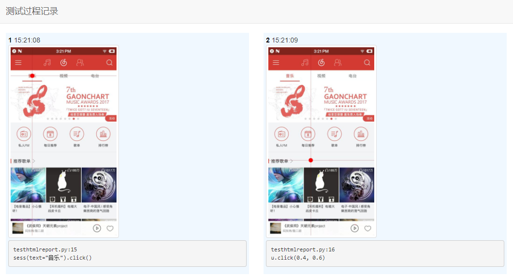

# HTMLReport for uiautomator2

Demo code

```python
# coding: utf-8

import uiautomator2 as u2
import uiautomator2.ext.htmlreport as htmlreport


u = u2.connect()
hrp = htmlreport.HTMLReport(u)

# take screenshot before each click
hrp.patch_click()

u.click(0.4, 0.6)
u.click(0.4, 0.5)
u(text="Github").click() # will also record
```

## Screenshot


## LICENSE
MIT